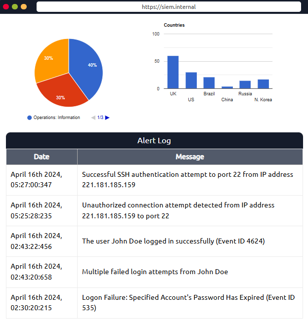
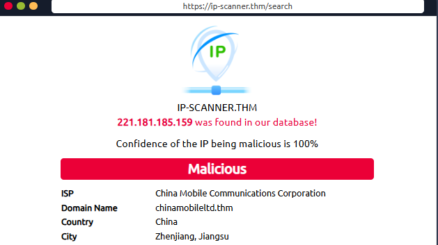
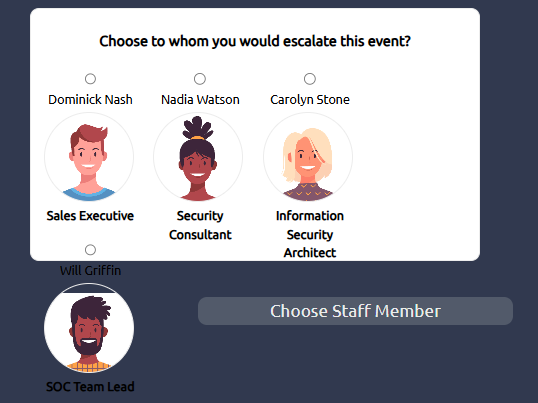
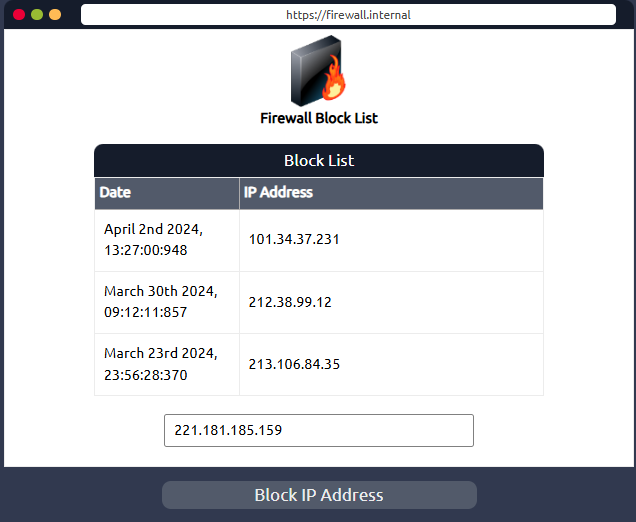

# 🛡️ SOC 1 - Lab: Detecção e Resposta a Incidente

 TryHackMe. No módulo SOC Level 1. O foco do laboratório foi identificar uma ameaça usando um sistema SIEM, bloquear o vetor malicioso com um firewall e realizar o reporte para a equipe responsável.

## 🧪 Cenário Simulado

- Plataforma: TryHackMe
- Lab: SOC Level 1 - Threat Detection
- Objetivo: Identificar atividades suspeitas com base em logs, aplicar contenção e reportar.

## 🔍 Etapas Realizadas

### 1. Identificação do IP Malicioso
- Ferramenta: **SIEM (Security Information and Event Management)**
- Ação: Análise de logs de rede para identificar um IP com comportamento suspeito.
- Resultado: IP identificado realizando múltiplas conexões em portas incomuns.

### 2. Contenção
- Ferramenta: **Firewall**
- Ação: Criação de regra de bloqueio para o IP malicioso.
- Resultado: Tráfego bloqueado com sucesso.

### 3. Reporte
- Canal: Comunicação interna simulada com a equipe de segurança.
- Ação: Envio de relatório técnico com evidências (IP, logs, ações).
- Resultado: Equipe notificada e medidas adicionais iniciadas.

## 📂 Evidências (simuladas)
- Screenshot da detecção no SIEM
  
  
- Identificação de ip
  

- Comunicação com a staff
  
  
- Exemplo da regra aplicada no firewall
  

## 📘 Conhecimentos Aplicados
- Análise de logs
- Threat Hunting
- Uso de SIEM
- Políticas de firewall
- Comunicação de incidentes

## 🧠 Lições Aprendidas
- A importância da correlação de eventos.
- Como reagir rapidamente a um incidente.
- Como documentar e escalar corretamente um alerta.

---

> 🔐 *Este repositório contém apenas documentação fictícia/educacional. Nenhuma informação real de rede foi usada.*
